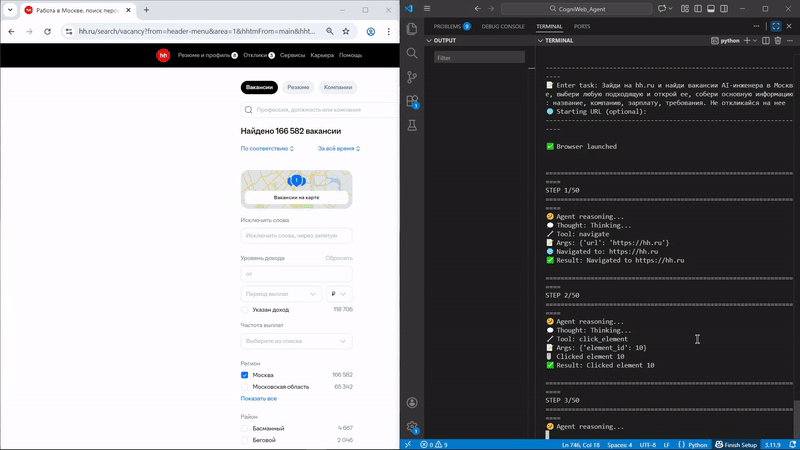
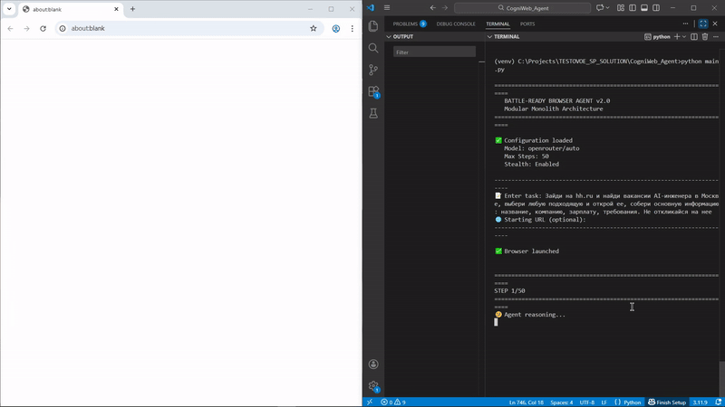

# 🤖 CogniWeb Agent

[](https://github.com/Ilyat9/CogniWeb_Agent/actions/workflows/ci.yml)
[](https://www.python.org/downloads/)
[](https://github.com/psf/black)
[](LICENSE.md)

Production-ready веб-агент с архитектурой **ReAct** (Reasoning + Acting), реализующий автономную навигацию и взаимодействие с веб-сайтами через LLM-управляемую автоматизацию браузера.

> [!IMPORTANT]
> **[Прочитать Self-Review: Архитектурные решения и компромиссы](./SELF_REVIEW.md)** — обязательный документ для понимания логики работы агента в условиях ограниченных ресурсов (API free tier, лимиты контекста).

<p align="center">
  
</p>

## 📋 О проекте

Агент использует **Playwright** для управления браузером и **LLM** (через OpenRouter API) для принятия решений. В отличие от простых скриптовых ботов, агент способен анализировать DOM страницы, планировать последовательность действий и адаптироваться к изменениям интерфейса без жёсткой привязки к селекторам.

Архитектура построена как **модульный монолит** с чётким разделением слоёв: конфигурация, бизнес-логика, инфраструктура и оркестрация. Все компоненты изолированы через Dependency Injection, что обеспечивает тестируемость и гибкость.

## ✨ Ключевые возможности

- **ReAct Pattern**: Цикл Observe → Think → Act с reasoning на каждом шаге
- **11 инструментов**: navigate, click_element, type_text, upload_file, scroll_page, take_screenshot, wait, go_back, query_dom, store_context, done
- **Stealth Mode**: playwright-stealth для обхода базовых антибот-систем
- **Smart Loop Detection**: Детекция зацикливаний с анализом (action + target + success)
- **Error Recovery**: Автоматические снимки (screenshot + HTML dump) при сбоях
- **Rate Limiting**: Настраиваемый контроль частоты запросов к LLM API (по умолчанию 15 сек между запросами)
- **Context Management**: Сохранение извлечённых данных между шагами
- **Graceful Shutdown**: Корректное закрытие браузера при SIGINT/SIGTERM
- **Local LLM Provider Mode**: Явно поддерживаемый режим для локальных OpenAI-совместимых серверов (LM Studio и аналоги), без ломки OpenRouter-сценария по умолчанию
- **Generalized Click/DOM Fallbacks**: Многоуровневая деградация при клике (overlay-баннеры, анимации, `.first`, forced click, JS dispatch) и разметка визуально похожих элементов
- **Context Compaction**: LLM-суммаризация истории для длинных сессий вместо грубого обрезания (аналог `/compact`)
- **Vision Fallback with Grounding**: Резервный визуальный режим со скриншотом и пронумерованными элементами для «сложных» страниц

## 🛠 Технологический стек

### Основные технологии
- **Python 3.10+**: Async/await, Type hints, Pydantic v2
- **Playwright 1.40+**: Браузерная автоматизация с stealth режимом
- **OpenRouter API**: LLM интеграция (совместим с OpenAI SDK)
- **Pydantic Settings**: Type-safe конфигурация с валидацией

### Инфраструктура и автоматизация
- **Docker**: Многоэтапная сборка на базе `mcr.microsoft.com/playwright/python`
- **Makefile**: Автоматизация задач (установка, тестирование, линтинг, Docker)
- **GitHub Actions**: CI/CD пайплайн (тесты на Python 3.10-3.12, проверка безопасности)
- **Pytest**: Unit-тесты с моками и покрытием кода
- **Ruff + Black + isort**: Линтинг и форматирование кода
- **Bandit + Safety**: Сканирование безопасности кода и зависимостей

## ⚖️ Архитектурные решения и оптимизация ресурсов

Проект разработан в условиях жестких временных (3 дня) и бюджетных (free tier API) ограничений. Каждое архитектурное решение — это осознанный компромисс между идеальностью и pragmatic engineering.

### 🎯 Философия проекта

> **"Working MVP сегодня > Идеальная система через месяц"**

Приоритеты при разработке:
1. **Надежность** (Resilience) — агент не должен падать при API глюках или нестандартных страницах
2. **Экономия токенов** (Token Efficiency) — стабильная работа в рамках жестких лимитов (16k контекста Solar Pro и аналогичных free-tier моделей).
3. **Поддерживаемость** (Maintainability) — код должен быть понятен следующему разработчику без моих комментариев

### 💰 Оптимизация ресурсов (API Efficiency)

Проект адаптирован для работы с бесплатными API-провайдерами, где каждый токен на счету:

#### **Token Economy**
```python
# Управление контекстом (orchestrator.py)
window_size = 10  # Последние 10 сообщений в истории диалога

# Расчет токенов:
# - System prompt: ~2k токенов
# - 10 observations × ~1.5k = 15k токенов
# - Итого: ~17k (укладываемся в 16k Solar Pro при среднем сценарии)
```

**Почему НЕ динамический подсчет через tiktoken:**
- Добавил бы зависимость и +50ms на каждый шаг
- Fixed window работает в 99% случаев
- **Fail-fast:** если контекст переполнится → LLM вернет ошибку → обработается retry

#### **Smart DOM Filtering**
```python
# DOM processing (dom.py)
elements[:50]  # Топ 50 интерактивных элементов

# Экономия:
# - 50 элементов = ~1000 токенов
# - Все 200 элементов = ~20k токенов (instant overflow)
# - Fallback: scroll_page → новые 50 элементов при необходимости
```

**Почему именно 50:**
- 99% действий пользователя — в первых 50 элементах viewport (header, navigation, main content)
- Сортировка по Y-позиции гарантирует приоритет видимых элементов
- Аналогия: pagination в REST API (GitHub = 100 items/page)

#### **Strict Rate Limiting**
```python
# Защита от 429 ошибок (orchestrator.py)
RATE_LIMIT_SECONDS = 15  # Задержка между LLM запросами

# Стратегия:
# - OpenRouter free tier: ~10-20 req/min (soft limit)
# - 15s delay = 4 req/min (безопасная зона)
# - Trade latency for stability
```

**Альтернатива (почему НЕ aggressive requests):**
- Без delay → 429 error → exponential backoff → агент стоит 1-2 минуты
- С delay 15s → агент медленнее, но стабильнее (лучший UX для MVP)

### 🛡️ Defensive Programming Patterns

Каждый компонент имеет fallback стратегию для production reliability:

#### **Browser Strict Mode Handling**
```python
# browser.py - обработка неуникальных селекторов
try:
    await page.click(selector)
except StrictModeViolation:
    # Fallback: используем первый matching элемент
    await page.locator(selector).first.click()
    logger.warning(f"Non-unique selector: {selector}")
```

**Почему `.first` fallback — это правильно:**
- hh.ru и многие сайты дублируют элементы (desktop + mobile версии в DOM)
- Playwright официально рекомендует `.first` для списков
- Graceful degradation вместо crash

#### **LLM JSON Parsing Recovery**
```python
# llm.py - обработка truncated responses
if "No valid JSON found" in error:
    # Агрессивный trim истории
    messages = self.get_trimmed_history(window_size=2)
    # Retry с минимальным контекстом
```

#### **Captcha Detection без Deadlock**
```python
# orchestrator.py - обработка капчи
while await browser.detect_captcha():
    print("⏳ Ожидание решения капчи...")
    await asyncio.sleep(3)  # Не блокирует в CI/Docker
```

### 🚀 Масштабирование и будущие улучшения

Архитектура позволяет легко перейти на платные тиры или добавить продвинутые фичи:
```python
# settings.py - "крючки" для будущих расширений
class Settings(BaseSettings):
    # Легко добавить:
    conversation_window_size: int = Field(default=10)  # Увеличить для paid tier
    dom_max_elements: int = Field(default=50)          # Больше контекста
    enable_evaluator: bool = Field(default=False)      # Self-critique loop
    rate_limit_seconds: int = Field(default=15)        # Агрессивнее для paid API
```

**Roadmap v2.0:**
- [ ] Evaluator Pattern (self-critique loop) — +2× качество, +2× токены
- [ ] Динамический подсчет токенов через tiktoken — точность вместо простоты
- [x] Автосолвинг капч осознанно НЕ реализуется (нарушает ToS целевых сайтов и абьюзит accessibility-фичу audio challenge) — вместо этого human-in-the-loop с checkpoint (`CAPTCHA_AVOIDANCE_MODE` для снижения частоты триггеров + сохранение прогресса на время ручного решения, см. SELF_REVIEW.md)
- [ ] Multi-page agents — параллельная обработка задач
- [x] Поддержка локальных LLM-провайдеров (LM Studio и аналоги) — см. раздел «Новые возможности»
- [x] Обобщение DOM/click-фолбэков за пределы hh.ru
- [x] Context Compaction (LLM-суммаризация вместо грубого обрезания)
- [x] Vision fallback со скриншотом и grounding через element_id

### 📊 Технический долг (осознанный)

| Компонент      | Текущее решение        | Идеальное решение  | Причина отказа             |
|----------------|------------------------|--------------------|----------------------------|
| Token counting | Fixed window (10 msgs) | Dynamic tiktoken   | KISS принцип для MVP       |
| DOM elements   | Hard limit 50          | Relevance scoring  | Token budget constraints   |
| Rate limiting  | Fixed 15s delay        | Adaptive per model | Free tier unpredictability |
| Error recovery | .first fallback        | Unique selectors   | Real-world DOM complexity  |
| Evaluator      | Not implemented        | Self-critique loop | +3 days dev, +2× tokens    |

**Философия:** Эти "компромиссы" — не баги, а **feature** для работы в resource-constrained environments.


## 🧩 Новые возможности

Ниже — четыре расширения, добавленные поверх исходной архитектуры. Все они **аддитивны и opt-in**: поведение по умолчанию (OpenRouter, текстовый режим, жёсткое обрезание истории) не изменилось.

### 1. Локальные LLM-провайдеры (LM Studio и аналоги)

Раньше конфигурация была жёстко привязана к OpenRouter, а валидация URL/модели специально блокировала локальные адреса (в первую очередь — стандартный порт Ollama), потому что локальный запуск считался «случайной ошибкой пользователя».

Теперь это осознанный режим:
```env
LLM_PROVIDER_MODE=local
OPENAI_API_KEY=lm-studio          # любой непустой плейсхолдер
API_BASE_URL=http://localhost:1234/v1
MODEL_NAME=your-loaded-model-name  # без ограничения формата provider/model
```
`LLM_PROVIDER_MODE=cloud` (значение по умолчанию) сохраняет все прежние проверки OpenRouter без изменений. В локальном режиме также используется отдельный, гораздо более короткий rate-limit (`LOCAL_RATE_LIMIT_SECONDS`, по умолчанию 1с вместо 15с) — у локального сервера нет внешнего API-лимита, но полностью убирать паузы не стали, чтобы не создавать тепловую/производительную нагрузку на локальную машину при желании можно выставить `0`.

**Проверка:** поднять LM Studio, указать `LLM_PROVIDER_MODE=local` и адрес сервера, прогнать простую задачу (например, открыть страницу и извлечь заголовок) — агент должен пройти цикл Observe→Think→Act без срабатывания валидаторов, рассчитанных на OpenRouter.

### 2. Обобщение DOM-логики за пределы hh.ru

Часть логики поиска/клика элементов была отлажена именно на hh.ru (дублирование desktop/mobile разметки, ARIA-навигация в SPA). Это расширено до более общей лестницы деградации:
- обнаружение и закрытие типичных cookie-consent/модальных оверлеев перед повторной попыткой клика;
- `.first`-фолбэк при неуникальном селекторе (было и раньше);
- forced click (обход проверок актуальности состояния) для элементов, временно недоступных из-за анимации/полупрозрачного перекрытия;
- JS `dispatch_event('click')` как последний резерв, если даже forced click не сработал;
- расширенный набор ARIA-ролей (`menuitem`, `tab`, `checkbox`, `radio`, `option`), `contenteditable`, `summary` — не только `button`/`a`/`[role=link]`;
- разметка визуально одинаковых элементов порядковым номером в тексте (`"Apply (#2 of 5 similar)"`), чтобы модель могла различать одинаковые кнопки в списке.

**Проверка:** воспроизвести страницу с cookie-баннером поверх нужной кнопки и убедиться, что клик проходит через уровень «dismiss overlay», а не сразу падает с `ElementNotFound`; открыть список из нескольких одинаковых кнопок и проверить, что в наблюдении у них разные порядковые подписи.

### 3. Context Compaction (аналог `/compact`)

Раньше при разрастании истории или ошибке применялось только грубое обрезание — хранились последние N сообщений, а всё остальное безвозвратно терялось. Теперь это дополняется (не заменяется) сжатием через LLM:
- триггер — количество сообщений (`COMPACTION_TRIGGER_MESSAGES`, по умолчанию 30) **или** оценка размера в токенах (`COMPACTION_TRIGGER_TOKENS_ESTIMATE`, по умолчанию 12000, через дешёвую эвристику `len(text)/4`, без tiktoken — в духе существующего подхода проекта);
- при срабатывании агент отдельным вызовом `LLMService.generate_text()` просит модель сжать всю рабочую историю в короткий отчёт: исходная задача, что уже сделано, какие данные уже извлечены/сохранены, текущий URL/состояние, что уже не сработало;
- этот отчёт становится новой «базовой» историей — `conversation_history` заменяется на `[system_prompt, summary]`, и дальнейшая работа идёт поверх него;
- не конфликтует с существующим `get_trimmed_history()` и loop detection — они продолжают работать как раньше поверх (уже сжатой) истории;
- при сбое суммаризации компакция просто пропускается в этом цикле — это не фатальная ошибка.

Отключается через `ENABLE_CONTEXT_COMPACTION=false`.

**Проверка:** прогнать длинную синтетическую историю (30+ сообщений или объёмные наблюдения), убедиться в логе в строке `Context compacted: N messages -> 1 summary message`, и что после этого агент продолжает опираться на факты, упомянутые в сжатом резюме (например, ранее сохранённый через `store_context` результат).

### 4. Vision Fallback с grounding

Раньше агент «видел» страницу только через текстовое представление DOM, которое на тяжёлых/плохо структурированных сайтах может быть либо пустым (сбой извлечения), либо избыточно большим и малоинформативным (сотни элементов почти без текста).

Теперь для таких случаев есть визуальный резерв:
- срабатывает, только если `ENABLE_VISION_FALLBACK=true` **и** `MODEL_SUPPORTS_VISION=true` (по умолчанию `false` — на облачных текстовых моделях ничего не меняется);
- условия переключения: извлечение DOM упало с ошибкой, вернуло пустой список, либо вернуло больше `VISION_FALLBACK_MAX_ELEMENTS` элементов, из которых у подавляющего большинства нет осмысленного текста;
- в этих случаях делается скриншот страницы с наложенными пронумерованными рамками поверх интерактивных элементов — номер на рамке это тот же `element_id`, что используется в текстовом режиме, поэтому ответ модели («элемент 7») напрямую превращается в `click_element(id=7)` без свободного текстового описания положения на экране;
- если вызов с изображением по любой причине падает, агент откатывается на обычный текстовый режим на этом же шаге — фича не «ломает» сессию;
- это осознанно редкий, дорогой по времени фолбэк, а не тихий режим по умолчанию — при нормальном DOM он не вызывается вовсе.

**Проверка:** взять «шумную» тестовую страницу (много одинаковых `<div>` без текста), включить `MODEL_SUPPORTS_VISION=true` с реально vision-моделью, убедиться в логе `Text-based DOM extraction looked unreliable - trying vision fallback...`, и что выбранный моделью номер соответствует правильному элементу на скриншоте.

## 🧩 Фаза 4: Web UI, новые инструменты, stealth-режим

Четыре расширения (подробности — в `ARCHITECTURE.md` → «Фаза 4»). Все новые флаги — opt-in с сохранением дефолтного поведения; единственное исключение — stealth-режим (включён по умолчанию, т.к. меняет только надёжность сессии, не функциональность).

### 5. Web UI поверх API

Веб-интерфейс больше не требует работать с агентом через терминал/curl:

```bash
make install-ui   # fastapi + uvicorn + websockets (requirements-ui.txt)
make run-ui       # API + UI на http://localhost:8000
```

Возможности: запуск задачи из формы; живой пошаговый прогресс (WebSocket `/ws/task/{id}`, с polling-fallback на `GET /task/{id}/steps` — thought/tool/args/статус/длительность); текущий скриншот и URL; история задач с детальным просмотром (`tokens_used`, `steps_taken`, `context_data`); отчёты `reports/run_*.json` в человекочитаемом виде; кнопка «Остановить» (per-task graceful stop — тот же паттерн `shutdown_check`, что у Ctrl+C, но на одну задачу); явный баннер капчи и captcha circuit breaker; read-only просмотр конфигурации через `GET /config` (секреты маскируются).

Фронтенд — single-file vanilla-JS SPA (`src/api/static/index.html`), отдаётся самим FastAPI. Выбор обоснован: нулевой build-пайплайн и нулевые JS-зависимости; HTMX потребовал бы jinja2, React+Vite — отдельного сборочного шага и версионируемого бандла, что для этого UI избыточно.

### 6. Десять новых инструментов агента

`wait_for_element` (условное ожидание вместо «слепого» `wait`), `find_element_by_text` (семантический поиск по живому DOM), `extract_page_content` (очищенный Markdown страницы — экономия 60–80% токенов; `ENABLE_MARKDOWN_EXTRACTION`, по умолчанию выключен), `extract_structured_data` (таблицы сразу в `context_data`), `hover_element`, `press_key`, `list_tabs`/`switch_tab` (работа с вкладками), `download_file` (сохранение в `DOWNLOAD_ALLOWED_DIR` с защитой от path traversal), `go_forward`. Полная таблица с обоснованием выбора — в `ARCHITECTURE.md`.

### 7. Идеи Browser-Use и Crawl4AI (реализованы как принятые решения)

- **Визуальный fallback (set-of-marks)**: после `VISUAL_FALLBACK_ERROR_STREAK` (по умолчанию 2) подряд ошибок `InvalidElementId` следующий шаг переключается на аннотированный скриншот (рамки с номерами = `element_id`). Флаг `ENABLE_VISUAL_FALLBACK` — альтернативное написание существовавшего до этой задачи `ENABLE_VISION_FALLBACK`; его дефолт `true` **сохранён без изменений** (правило проекта: дефолты существующих фичей не меняются). Эффективное поведение по умолчанию всё равно выключено: каждый vision-вызов гейтится `MODEL_SUPPORTS_VISION` (дефолт `false`) — текстовые провайдеры не получают изображения, пока оба флага не включены явно. Пакет `browser-use` НЕ используется как зависимость; платные captcha-solving сервисы НЕ интегрируются — путь для показанной капчи прежний: `CaptchaDetectedError` → ручное решение → circuit breaker.
- **Markdown-экстракция**: `extract_page_content` берёт HTML уже открытой Playwright-страницы; конвертация через опциональный `crawl4ai` (только как HTML→Markdown конвертер, свой браузер не запускает; `requirements-tools.txt`, ленивый импорт) с fallback на встроенный беззависимый очиститель.

### 8. Stealth-режим браузера (`ENABLE_STEALTH_MODE`, по умолчанию `true`)

Снижает вероятность, что легитимную сессию ошибочно классифицируют как автоматизацию (что и провоцирует лишние капчи): init-скрипты, убирающие сигналы автоматизации (`navigator.webdriver`, пустые `plugins`, WebGL-заглушка headless); согласованный профиль `STEALTH_USER_AGENT`/`STEALTH_LOCALE`/`STEALTH_TIMEZONE`/`STEALTH_VIEWPORT_*` (рассинхрон фингерпринта — сам по себе сигнал детекции сильнее «неидеального, но цельного» профиля); человекоподобные клики (многоточечная траектория мыши с джиттером) и посимвольный ввод. `playwright-stealth` — опциональная надстройка (перенесён в `requirements-tools.txt`, ленивый импорт + один warning за run). Это про снижение ложных срабатываний детекции, НЕ про решение уже показанной капчи. `ENABLE_STEALTH_MODE=false` возвращает точное до-stealth поведение (для отладки/сравнения скриншотов).

### 9. Hardening: защита доступа к API (дополнение)

Агент управляет реальным браузером — API без защиты на публичном IP позволил бы кому угодно ставить задачи от имени сервера. Полноценные пользователи/OAuth для локального self-hosted сценария избыточны, поэтому:

- **`API_BIND_HOST`** (дефолт `127.0.0.1`, не `0.0.0.0`) — безопасный дефолт «только localhost»; внешний доступ — явный opt-in. `make run-ui` читает именно эту настройку. (Docker `MODE=api` биндит `0.0.0.0` внутри контейнера сознательно — иначе порт был бы недостижим с хоста; при публикации порта задайте токен.)
- **`API_AUTH_TOKEN`** (опционально, дефолт выключен — обратная совместимость): если задан, все `/task*`-эндпоинты плюс `/config`, `/reports` и WebSocket требуют `Authorization: Bearer <token>`, иначе `401`; `/health` открыт без токена (liveness-проби). UI вводит токен в поле справа вверху и держит его только в памяти вкладки (не localStorage).
- **`on_step`-хук**: колбэк оркестратора (по образцу `shutdown_check`), через который API-воркер обновляет запись задачи — `GET /task/{id}` отдаёт `current_step`/`last_tool` уже ВО ВРЕМЯ выполнения, не только после завершения.
- **Path-traversal-гарды** файловых эндпоинтов: путь скриншота резолвится и обязан оставаться внутри `SCREENSHOT_DIR`; `run_id` — строгий паттерн + resolve-проверка внутри `REPORTS_DIR`.
- **CI-гвард против капча-солверов**: `make check-no-captcha-solvers` (входит в `make ci`) — механическая гарантия, что `2captcha/anti-captcha/capmonster/capsolver/gatesolve` не протащены в `src/` или requirements.
- **Untrusted-контент**: результаты всех content-возвращающих инструментов (`extract_page_content`, `extract_structured_data`, `find_element_by_text`, `query_dom`) попадают в историю диалога только в обёртке `<untrusted_page_content>` — тот же механизм, что у DOM-наблюдения; регрессионный тест фиксирует.
- **Санитизация входящих задач** (`POST /task`, до очереди): всегда — гигиена ввода (`TASK_MAX_LENGTH`, дефолт 10000; пустой/пробельный текст; управляющие символы; текст без единого алфавитно-цифрового символа), отклонение = HTTP 400 с машинным именем правила. Опционально (выключено по умолчанию) — контент-фильтр: `ENABLE_TASK_CONTENT_FILTER=true` + `TASK_FORBIDDEN_PATTERNS` (построчные case-insensitive regex). Каждое отклонение пишется в отдельный JSONL-аудит `TASK_AUDIT_LOG_PATH`. ⚠️ Это **базовая защита от очевидных злоупотреблений, а НЕ модерация**: статический regex не классифицирует намерение и обходится перефразированием; для настоящего публичного сервиса нужен более серьёзный уровень (умная классификация, человеческий ревью) — возможности фильтра сознательно не переоцениваются.


**Известные backlog-пункты (осознанно вне скоупа):** ротация/очистка `DOWNLOAD_ALLOWED_DIR` (файлы копятся на долгоживущей машине — до реализации чистить вручную или внешним cron); rate-limit на уровне самого API (нужен при деплое с `API_BIND_HOST` ≠ 127.0.0.1; LLM-рейт-лимит `_wait_for_rate_limit` закрывает только провайдера).

## 🚀 Быстрый старт

### Вариант 1: Локальная установка (рекомендуется для разработки)

```bash
# Клонировать репозиторий
git clone https://github.com/Ilyat9/CogniWeb_Agent
cd CogniWeb_Agent

# Установить зависимости и браузеры
make install-dev

# Настроить .env
make setup-env
# Отредактировать .env: добавить OPENAI_API_KEY

# Запустить агента
make run
```

### Вариант 2: Docker (рекомендуется для продакшена)

```bash
# Собрать образ
make docker-build

# Запустить контейнер
make docker-run

# Или через docker напрямую
docker build -t cogniweb-agent .
docker run --rm -v $(pwd)/.env:/app/.env:ro cogniweb-agent
```

**Подробная инструкция**: [QUICK_START.md](QUICK_START.md)

## 📁 Структура проекта

```
.
├── main.py                      # Entry point с signal handling
├── Dockerfile                   # Многоэтапная сборка (non-root user)
├── Makefile                     # Автоматизация команд
├── pyproject.toml               # Конфигурация инструментов (black, ruff, pytest)
├── requirements.txt             # Production зависимости
├── requirements-dev.txt         # Development зависимости (pytest, ruff, etc)
├── .env.example                 # Шаблон конфигурации
│
├── src/
│   ├── config/
│   │   ├── settings.py          # Pydantic Settings с валидацией
│   │   └── __init__.py
│   │
│   ├── core/
│   │   ├── models.py            # AgentAction, TaskResult, ObservationState
│   │   ├── exceptions.py        # Иерархия исключений
│   │   └── __init__.py
│   │
│   ├── infrastructure/
│   │   ├── browser.py           # BrowserService (Playwright)
│   │   ├── llm.py               # LLMService (OpenRouter API)
│   │   └── __init__.py
│   │
│   ├── agent/
│   │   ├── orchestrator.py      # ReAct цикл (observe/think/act)
│   │   └── __init__.py
│   │
│   └── utils/
│       ├── dom.py               # DOM tree shaking и оптимизация
│       └── __init__.py
│
├── tests/
│   ├── test_agent_core.py       # Unit-тесты (Pydantic, orchestrator, LLM)
│   └── __init__.py
│
├── .github/
│   └── workflows/
│       ├── ci.yml               # CI пайплайн (тесты, линтинг, безопасность)
│       └── release.yml          # Автоматизация релизов
│
├── browser_data/                # Persistent browser session (создаётся при запуске)
├── screenshots/                 # Error snapshots (создаётся при запуске)
├── agent.log                    # Лог файл (создаётся при запуске)
│
├── QUICK_START.md               # Подробная инструкция по установке
├── ARCHITECTURE.md              # Архитектурная документация
├── CLAUDE.md                    # Руководство для Claude Code
├── docs/DEPLOYMENT.md           # Продакшен-деплой (nginx/TLS/systemd/бэкапы)
├── docs/MONITORING.md           # Prometheus /metrics, /health, Sentry
└── LICENSE.md                   # MIT License
```

## ⚙️ Конфигурация

Основные параметры в `.env`:

```env
# API (обязательно)
OPENAI_API_KEY=your_openrouter_api_key
API_BASE_URL=https://openrouter.ai/api/v1
MODEL_NAME=upstage/solar-pro

# Браузер
HEADLESS=false                    # true для продакшена
SLOW_MO=50                        # задержка между действиями (мс)
ENABLE_STEALTH=true               # playwright-stealth

# Агент
MAX_STEPS=50                      # лимит шагов
TEMPERATURE=0.1                   # детерминированность LLM
MAX_TOKENS=1000                   # размер ответа LLM

# DOM оптимизация
TEXT_BLOCK_MAX_LENGTH=500         # обрезка длинных текстов
DOM_MAX_TOKENS_ESTIMATE=10000     # лимит токенов для DOM

# Loop detection
LOOP_DETECTION_WINDOW=3           # окно для проверки
MAX_IDENTICAL_STATES=5            # терпимость к повторам

# Провайдер LLM (по умолчанию — облако/OpenRouter, без изменений поведения)
LLM_PROVIDER_MODE=cloud           # или "local" для LM Studio и аналогов
LOCAL_RATE_LIMIT_SECONDS=1.0      # пауза между запросами только в local-режиме

# Context Compaction (сжатие истории для длинных сессий)
ENABLE_CONTEXT_COMPACTION=true
COMPACTION_TRIGGER_MESSAGES=30
COMPACTION_TRIGGER_TOKENS_ESTIMATE=12000

# Vision Fallback (резервный визуальный режим)
ENABLE_VISION_FALLBACK=true
MODEL_SUPPORTS_VISION=false       # включайте только для реально vision-моделей
VISION_FALLBACK_MAX_ELEMENTS=80
```

Полный список параметров в [.env.example](.env.example)

## 💡 Примеры задач

**Навигация и поиск**:
```
Задача: Найди статью про Python на википедии и скажи год создания языка
URL: https://wikipedia.org
```

**Заполнение форм**:
```
Задача: Найди форму регистрации, заполни поля (имя: Test, email: test@example.com)
```

**Извлечение данных**:
```
Задача: Найди на странице все цены товаров и сохрани их
```

**Многошаговые сценарии**:
```
Задача: Перейди на hacker news, открой первую статью, прочитай заголовок и первый абзац
URL: https://news.ycombinator.com
```

### 📺 Полная демонстрация работы (hh.ru)


## 🧪 Тестирование

Проект покрыт Unit-тестами с использованием `pytest` и `pytest-asyncio`. Все внешние зависимости (LLM, Browser) изолированы через моки.

### Запуск тестов:

```bash
# Все тесты с подробным выводом
make test

# Тесты с coverage отчётом
make test-coverage

# Только тесты loop detection
pytest tests/test_agent_core.py::TestSmartLoopDetection -v
```

### CI/CD пайплайн

При каждом push в `main` или `develop` автоматически запускаются:

1. **Линтинг**: Ruff, Black, isort
2. **Тесты**: Pytest на Python 3.10, 3.11, 3.12
3. **Безопасность**: Bandit (код), Safety (зависимости)
4. **Docker**: Сборка образа (только на main/develop)

## 📦 Docker

> ⚠️ **Безопасность при `MODE=api` в Docker:** контейнер осознанно биндит uvicorn на `0.0.0.0` — иначе опубликованный порт (`-p 8000:8000`) был бы недостижим с хоста. Это НЕ защищается настройкой `API_BIND_HOST` (она относится к запускам без Docker: `make run-ui`). Если вы публикуете порт контейнера в сеть/интернет — **обязательно задайте `API_AUTH_TOKEN`** и держите контейнер за файрволом/reverse-proxy. Без токена любой, кому доступен порт, может ставить задачи от имени сервера.

### Многоэтапная сборка

Dockerfile использует два stage:
- **builder**: Установка зависимостей как root
- **runtime**: Запуск от не-привилегированного пользователя `agentuser`

### Основные команды

```bash
# Сборка образа
make docker-build

# Запуск контейнера
make docker-run

# Запуск тестов в Docker
make docker-test

# Интерактивная оболочка для отладки
make docker-shell

# Очистка
make docker-clean
```

## 🎯 Архитектура

Проект следует принципам **модульного монолита**:

```
┌─────────────────────────────────────┐
│      main.py (Entry Point)          │
│  Signal Handling, Orchestration     │
└──────────────┬──────────────────────┘
               │
┌──────────────▼──────────────────────┐
│     Agent Layer (Orchestration)     │
│   orchestrator.py - ReAct Loop      │
└──────────────┬──────────────────────┘
               │
       ┌───────┴────────┐
       │                │
┌──────▼─────┐   ┌─────▼──────┐
│Infrastructure│  │   Core     │
│  browser.py  │  │ models.py  │
│   llm.py     │  │exceptions │
└──────────────┘  └────────────┘
       │                │
┌──────▼────────────────▼──────────┐
│     Config Layer (Settings)      │
│   settings.py - Pydantic Config  │
└──────────────────────────────────┘
```

**Подробнее**: [ARCHITECTURE.md](ARCHITECTURE.md)

## ⚠️ Ограничения

### Технические
- LLM может галлюцинировать несуществующие элементы на странице
- Не работает с CAPTCHA (требует ручного решения)
- Ограниченная поддержка iframe (нужен workaround)
- Динамические SPA могут вызывать проблемы с timing
- Лестница фолбэков клика (Task 2) — не универсальное решение: набор селекторов для overlay-баннеров основан на самых распространённых паттернах (OneTrust и текстовые фразы на нескольких языках) и не покрывает произвольную вёрстку
- Context Compaction (Task 3) тратит один дополнительный LLM-вызов при срабатывании триггера и зависит от качества суммаризации самой модели — на слабой локальной модели резюме может получиться менее точным
- Vision Fallback (Task 4) требует модель с поддержкой изображений и работает медленнее и дороже текстового режима — это осознанно редкий путь, а не замена основного

### Безопасность
- Stealth mode не гарантирует обход всех антибот-систем
- Не предназначен для обхода защиты сайтов с активной защитой
- Rate limiting может быть недостаточен для некоторых API

### Производительность
- Каждый шаг = 1 LLM запрос (15-30 сек при rate limiting)
- DOM processing добавляет overhead на больших страницах
- Медленнее специализированных скраперов с хардкодом

## 🤝 Разработка

### Локальная разработка

```bash
# Установить dev зависимости
make install-dev

# Запустить в dev режиме (с DEBUG_MODE=true)
make dev

# Проверить код
make lint

# Автоформатирование
make format

# Проверка типов
make type-check

# Проверка безопасности
make security-check
```

### Эмуляция CI локально

```bash
# Запустить все CI проверки
make ci
```

## 📄 Лицензия

MIT License — см. [LICENSE.md](LICENSE.md)

---

**Python**: 3.10+  
**Зависимости**: Playwright 1.40+, OpenAI SDK 1.0+, Pydantic 2.0+  
**Поддержка**: Issues и Pull Requests приветствуются

**Документация**:
- [Быстрый старт](QUICK_START.md)
- [Архитектура](ARCHITECTURE.md)
- [Продакшен-деплой](docs/DEPLOYMENT.md)
- [Мониторинг](docs/MONITORING.md)
- [Руководство для Claude Code](CLAUDE.md)