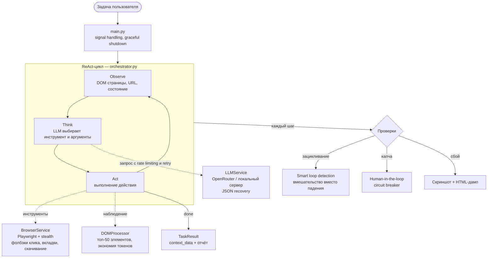

# CogniWeb Agent

[](https://github.com/Ilyat9/CogniWeb_Agent/actions/workflows/ci.yml)
[](https://www.python.org/downloads/)
[](https://github.com/psf/black)
[](LICENSE.md)

Веб-агент с архитектурой **ReAct** (Reasoning + Acting): сам перемещается по сайтам и взаимодействует с ними, а решения принимает LLM. Playwright отвечает за браузер, модель — за мышление.

> [!IMPORTANT]
> **[Self-Review: как устроен агент и почему именно так](./SELF_REVIEW.md)** — разбор ключевых решений: экономия токенов, политика работы с капчами, stealth, защита API.

<p align="center">
  
</p>

## О проекте

Скриптовые боты привязаны к заранее прописанным селекторам и ломаются от любого изменения вёрстки. Этот агент читает DOM страницы, планирует последовательность действий и подстраивается под то, что видит: если кнопка переехала или её закрыл cookie-баннер, он найдёт обходной путь.

Код организован как модульный монолит с чёткими слоями: конфигурация, бизнес-логика, инфраструктура, оркестрация. Зависимости внедряются через конструктор, поэтому каждый компонент покрывается тестами с моками — без реального браузера и API.

## Ключевые возможности

- **ReAct-цикл** — Observe → Think → Act с reasoning на каждом шаге
- **24 инструмента** — от навигации и кликов до вкладок, скачивания файлов и извлечения данных в Markdown; полная таблица с обоснованиями в [docs/ARCHITECTURE.md](docs/ARCHITECTURE.md)
- **Stealth-режим** — убирает сигналы автоматизации (`navigator.webdriver`, пустые `plugins`), держит согласованный фингерпринт (UA / locale / timezone / viewport), кликает и печатает по-человечески; `playwright-stealth` подключается опционально
- **Многоуровневые фолбэки клика** — закрытие cookie-баннеров, `.first` при неуникальном селекторе, forced click при анимациях, JS-dispatch как последний резерв; визуально одинаковые кнопки получают порядковые подписи («Apply, #2 из 5»)
- **Smart loop detection** — зацикливания распознаются по связке «действие + цель + результат», а не только по наблюдениям
- **Context compaction** — при разрастании истории модель сжимает её в короткое резюме (аналог `/compact`), вместо грубого обрезания
- **Vision fallback** — резервный режим со скриншотом и пронумерованными элементами для страниц, где текстовый DOM пуст или шумный
- **Rate limiting** — 15 секунд между запросами к облачному API по умолчанию, 1 секунда для локального сервера
- **Локальные LLM** — режим для OpenAI-совместимых серверов (LM Studio, Ollama, vLLM), не ломающий OpenRouter-сценарий
- **Web UI** — запуск задач и живой пошаговый прогресс по WebSocket прямо в браузере
- **Graceful shutdown** — корректное закрытие браузера по SIGINT/SIGTERM

## Технологический стек

**Основное**

- Python 3.10+ — async/await, type hints, Pydantic v2
- Playwright 1.40+ — браузерная автоматизация
- OpenRouter или любой OpenAI-совместимый API — LLM

**Инфраструктура**

- Docker (многоэтапная сборка), Makefile, GitHub Actions (тесты на Python 3.10–3.12, security-сканы)
- Pytest с coverage, Ruff + Black + isort, Bandit + Safety

## Экономия токенов

Агент рассчитан в том числе на бесплатные модели с небольшим контекстом (~16k), поэтому расход токенов контролируется на нескольких уровнях:

| Механизм | Что делает |
|----------|------------|
| Окно истории | В промпт уходят последние 10 сообщений, а не вся история |
| Фильтрация DOM | Топ-50 интерактивных элементов по позиции во viewport; остальное доступно через `scroll_page` |
| Rate limiting | 15 c между запросами к облачному API (настраивается); локальному серверу хватает 1 c |
| Context compaction | История сжимается моделью в короткое резюме, работа продолжается поверх него |
| Markdown-экстракция | `extract_page_content` отдаёт очищенный текст — на 60–80% меньше токенов, чем сырой HTML |

Подсчёт токенов — простая эвристика `len(text)/4`, без tiktoken: для триггеров компакции точность до токена не нужна, а лишняя зависимость и задержка на каждом шаге ни к чему.

## Надёжность

У каждого слоя есть запасной сценарий: неуникальный селектор — клик по первому совпадению; обрезанный ответ LLM — повтор на урезанной истории; капча — пауза с ожиданием ручного решения и circuit breaker; падение шага — скриншот и дамп HTML для разбора.

Автосолвинг капч не делается намеренно: автоматический обход нарушает ToS целевых сайтов, поэтому путь здесь — human-in-the-loop (`CAPTCHA_AVOIDANCE_MODE` снижает частоту срабатываний, checkpoint сохраняет прогресс на время ручного решения).

## Расширения поверх базовой архитектуры

Все расширения аддитивны и opt-in: поведение по умолчанию (OpenRouter, текстовый режим) не меняется.

### Локальные модели

```env
LLM_PROVIDER_MODE=local
OPENAI_API_KEY=lm-studio           # любой непустой плейсхолдер
API_BASE_URL=http://localhost:1234/v1
MODEL_NAME=my-loaded-model         # формат provider/model не обязателен
```

Работает с любым OpenAI-совместимым сервером (LM Studio, Ollama, vLLM). Рекомендации моделей под разное железо, предупреждение про reasoning-модели и готовый docker compose-стек — в [docs/LOCAL_MODELS.md](docs/LOCAL_MODELS.md).

### Web UI

```bash
make install-ui   # fastapi + uvicorn + websockets
make run-ui       # интерфейс и API на http://localhost:8000
```

Запуск задачи из формы, живой пошаговый прогресс по WebSocket (с fallback на polling), текущий скриншот и URL, история задач с детальным просмотром, отчёты по запускам, кнопка «Остановить», явный баннер капчи, просмотр конфигурации с замаскированными секретами.

### Защита API

По умолчанию сервер слушает только `127.0.0.1` (`API_BIND_HOST`). Для доступа с других машин задайте `API_BIND_HOST` и обязательно `API_AUTH_TOKEN` — Bearer-токен закрывает все task-эндпоинты, `/config`, `/reports` и WebSocket; `/health` остаётся открытой liveness-пробой. В UI токен вводится справа вверху и хранится только в памяти вкладки.

Дополнительно: пути скриншотов и отчётов проверяются на path traversal, результаты инструментов, возвращающих текст страницы, оборачиваются в `<untrusted_page_content>` (защита от prompt injection), входящие задачи проходят санитизацию, опциональный контент-фильтр включается через `ENABLE_TASK_CONTENT_FILTER`.

### Инструменты

Помимо базовых `navigate` / `click_element` / `type_text`: `wait_for_element` (условное ожидание), `find_element_by_text`, `extract_page_content` (Markdown, флаг `ENABLE_MARKDOWN_EXTRACTION`), `extract_structured_data`, `hover_element`, `press_key`, `list_tabs` / `switch_tab`, `download_file`, `go_forward`, `assert_page_state`, `set_variable` / `get_variable`.

## Быстрый старт

### Локально (для разработки)

```bash
git clone https://github.com/Ilyat9/CogniWeb_Agent
cd CogniWeb_Agent

make install-dev   # зависимости + Chromium + dev-инструменты
make setup-env     # создать .env из шаблона и отредактировать: вписать OPENAI_API_KEY

make run
```

### Docker (для продакшена)

```bash
make docker-build
make docker-run

# или напрямую
docker build -t cogniweb-agent .
docker run --rm -v $(pwd)/.env:/app/.env:ro cogniweb-agent
```

Подробная инструкция — [docs/QUICK_START.md](docs/QUICK_START.md).

## Структура проекта

```
.
├── main.py                      # Entry point, signal handling
├── src/
│   ├── api/                     # FastAPI + Web UI (app, models, security, task_store, static/)
│   ├── agent/orchestrator.py    # ReAct-цикл
│   ├── config/settings.py       # Pydantic Settings
│   ├── core/                    # Доменные модели и исключения
│   ├── infrastructure/          # browser.py (Playwright), llm.py
│   └── utils/dom.py             # Извлечение и оптимизация DOM
├── requirements/                # base / dev / api / ui / tools + lock
├── tests/                       # Unit- и smoke-тесты
├── docs/                        # QUICK_START, ARCHITECTURE, DEPLOYMENT, MONITORING, LOCAL_MODELS
├── .env.example                 # Шаблон конфигурации
└── Makefile / Dockerfile / docker-compose.yml
```

## Конфигурация

Основные параметры `.env`:

```env
# API (обязательно)
OPENAI_API_KEY=your_openrouter_api_key
API_BASE_URL=https://openrouter.ai/api/v1
MODEL_NAME=upstage/solar-pro

# Браузер
HEADLESS=false                    # true для продакшена
SLOW_MO=50                        # задержка между действиями (мс)
ENABLE_STEALTH=true               # stealth-профиль браузера

# Агент
MAX_STEPS=50                      # лимит шагов
TEMPERATURE=0.1                   # детерминированность LLM
MAX_TOKENS=1000                   # размер ответа LLM

# DOM
TEXT_BLOCK_MAX_LENGTH=200         # обрезка длинных текстов
DOM_MAX_TOKENS_ESTIMATE=10000     # лимит токенов для DOM

# Loop detection
LOOP_DETECTION_WINDOW=3
MAX_IDENTICAL_STATES=5

# Провайдер LLM
LLM_PROVIDER_MODE=cloud           # или local — см. docs/LOCAL_MODELS.md
LOCAL_RATE_LIMIT_SECONDS=1.0
REASONING_STRIP_TAGS=think,reasoning  # теги reasoning-моделей, вырезаемые перед JSON-парсингом

# Context Compaction
ENABLE_CONTEXT_COMPACTION=true
COMPACTION_TRIGGER_MESSAGES=30
COMPACTION_TRIGGER_TOKENS_ESTIMATE=12000

# Vision Fallback
ENABLE_VISION_FALLBACK=true
MODEL_SUPPORTS_VISION=false       # включать только для vision-моделей
VISION_FALLBACK_MAX_ELEMENTS=80
```

Полный список параметров — в [.env.example](.env.example).

## Примеры задач

**Навигация и поиск**
```
Задача: Найди статью про Python на википедии и скажи год создания языка
URL: https://wikipedia.org
```

**Заполнение форм**
```
Задача: Найди форму регистрации, заполни поля (имя: Test, email: test@example.com)
```

**Извлечение данных**
```
Задача: Найди на странице все цены товаров и сохрани их
```

**Многошаговые сценарии**
```
Задача: Перейди на hacker news, открой первую статью, прочитай заголовок и первый абзац
URL: https://news.ycombinator.com
```

### Полная демонстрация работы (hh.ru)


## Тестирование

```bash
make test            # все тесты
make test-coverage   # с coverage-отчётом
pytest tests/test_agent_core.py::TestSmartLoopDetection -v
```

Все внешние зависимости (LLM, браузер) изолированы моками, поэтому тесты быстрые и детерминированные; отдельно есть smoke-тесты с реальным Chromium.

CI запускается на каждый push в `main`/`develop`: линтеры (Ruff, Black, isort), тесты на Python 3.10–3.12, Bandit и Safety, сборка Docker-образа. Локальная эмуляция — `make ci`.

## Docker

> Контейнер с `MODE=api` слушает `0.0.0.0` внутри — иначе опубликованный порт (`-p 8000:8000`) был бы недостижим с хоста. `API_BIND_HOST` здесь не защита: публикуете порт наружу — задайте `API_AUTH_TOKEN` и держите контейнер за reverse-proxy.

Сборка двухэтапная: **builder** ставит зависимости от root, **runtime** запускается от непривилегированного пользователя `agentuser`.

```bash
make docker-build    # сборка образа
make docker-run      # запуск контейнера
make docker-test     # тесты в контейнере
make docker-shell    # интерактивная оболочка для отладки
make docker-clean    # очистка
```

## Архитектура



Подробнее — [docs/ARCHITECTURE.md](docs/ARCHITECTURE.md).

## Ограничения

**Возможности агента**

- LLM может галлюцинировать несуществующие элементы; CAPTCHA решается только вручную
- Поддержка iframe ограничена; тяжёлые SPA иногда спотыкаются о тайминги

**Скорость**

- Один шаг = один LLM-запрос: при rate limiting это 15–30 секунд на шаг
- На больших страницах обработка DOM добавляет overhead — универсальный агент всегда медленнее скрапера с хардкодом

**Stealth и защита**

- Stealth снижает вероятность ложных срабатываний антибот-детекта, но не гарантирует проход и не предназначен для обхода активной защиты сайтов
- Закрытие оверлеев покрывает распространённые паттерны (OneTrust, текстовые баннеры), но не произвольную вёрстку

**Дополнительные режимы**

- Компакция контекста зависит от качества суммаризации модели — на слабых локальных моделях резюме может быть грубее
- Vision fallback требует vision-модель и работает медленнее и дороже текстового режима — это резервный путь, а не замена основному

## Разработка

```bash
make install-dev     # dev-зависимости
make dev             # запуск в dev-режиме (DEBUG_MODE=true)
make lint            # проверки кода
make format          # автоформатирование
make type-check      # проверка типов
make security-check  # безопасность
make ci              # эмуляция CI локально
```

## Лицензия

MIT License — см. [LICENSE.md](LICENSE.md).

---

Python 3.10+ · Playwright 1.40+ · OpenAI SDK 1.0+ · Pydantic 2.0+

Вопросы и предложения — через Issues, pull request'ы приветствуются.

**Документация**: [Быстрый старт](docs/QUICK_START.md) · [Архитектура](docs/ARCHITECTURE.md) · [Деплой](docs/DEPLOYMENT.md) · [Мониторинг](docs/MONITORING.md) · [Локальные модели](docs/LOCAL_MODELS.md)


